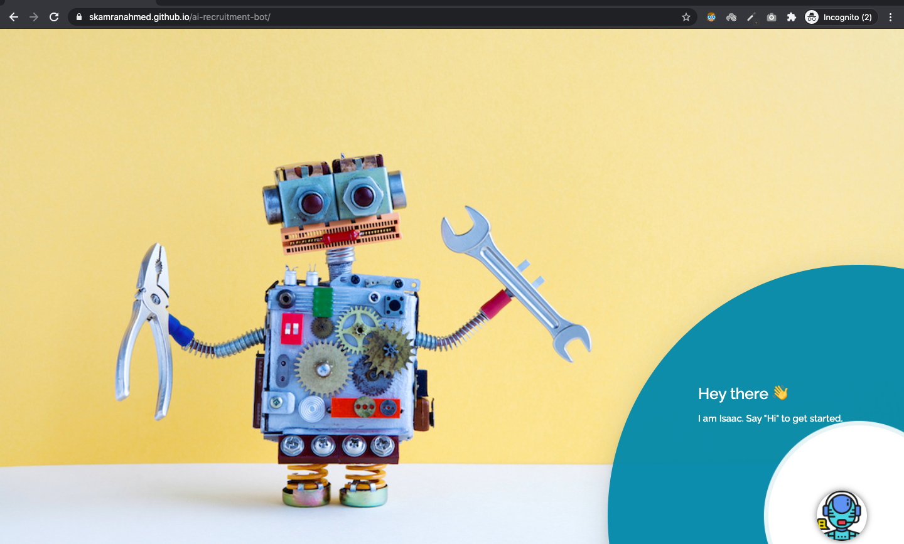

# AI Recruitment Bot using Rasa & Deployed on Heroku via Docker

## Introduction
- This is a chatbot application, implemented using Rasa with G-Sheet being used to keep track of Job Vacancies and 
Candidates who apply to the jobs. 
- The chatbot is deployed on Heroku via Docker, since the Rasa installation was exceeding 
the free limit provided by Heroku.
- This repository contains the backend code which is compatible with both the Web version of the chatbot and 
also for the Whatsapp version.

## Demo

## Files in the program
- **actions.py**: This is the main app file responsible for chatbot functionalites using Rasa.
- **scripts/**: Contains scripts for interacting with G-sheets, Answer analysis, Resume parsing and Video analysis
- **data/nlu.md**: Contains intents and respective training phrases for the bot
- **data/stories.md**: Contains the conversation flow of the bot
- **domain.yml**: All the intents, forms, actions for the bot are listed in this file

## Usage
### Run app
Use [the link to the production server](https://skamranahmed.github.io/ai-recruitment-bot/) directly.